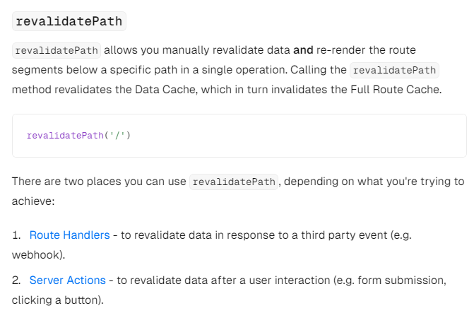

## 목적

Next.js 기술스택 학습 및 


## 기술 스택

Next.js

zustand

axios

tailwind css


## 기록

~8/8

- Next.js 시작 / app 라우팅
- 간단한 메인화면, Navbar, 게시글 UI 개발
- 게시글 리스트 조회, 게시글 조회, 게시글 작성 API 연결


8/9

- Kakao Login으로 인가 코드를 발급받고, 이를 사용해 로그인 API 연결


8/10

- 사이트 첫 진입 시 refresh_token 만료 안되었으면 이를 통해 access_token, refresh_token 재발급받고 로그인 유지되는 API 연결
- zustand 활용해 로그인 시 유저 정보 저장
- zustand-persist 미들웨어 활용해 정보 유지

- fetch -> axios로 교체

  

8/12

- api 함수들 axios로 모듈화 및 코드분리
- axios interceptor를 활용해 모든 API 요청에 access_token 포함
  - 각 API 함수에 access_token을 추가해야하는 코드 중복 제거 -> 가독성, 유지보수성 향상
- 게시글 리스트 및 게시글 디테일 페이지를 SSR(Server-Side Rendering)을 사용하여 구현했으며, 게시글 API 호출을 서버에서 처리하도록 설정
  - 결과적으로, 클라이언트는 게시글 데이터가 미리 채워진 HTML을 수신
  - 기존에는 첫 렌더링 이후 클라이언트에서 API 응답을 받아 다시 화면에 출력하기까지 시간이 소요되었으나, 이제 서버에서 API를 호출함으로써 렌더링 후 대기 시간을 제거

8/13

- axios interceptor를 활용해 access_token 만료 응답(401)시 refresh_token으로 access_token 재발급 후 API 재호출 기능 구현
  - access_token 만료시  {status: 401, action: 3}, refresh_token 만료시  {status: 401, action: 4}로 응답 받음
  - status가 401일 때 action에 따라 동작 분기
  - 이후 다른 status도 action 추가하고 동작 분기할 예정
- 게시글 리스트는 서버에서 API 호출을 하는데 이에 기본 cache time 30초 설정되어 있음
  - 때문에 게시글을 작성 후 바로 게시글 리스트로 가면 cache된 결과가 나오기 때문에 게시글 최신화가 되지 않음
  - next.js 공식문서에선 fetch API에서 {cache : 'no-store'}로 설정하면 된다고 나와있지만, 이 프로젝트에는 axios가 사용되었고 해당 옵션이 axios에는 적용 안되는 것을 확인
  - 더 공부해보고 axios를 사용하더라도 서버 캐시 비활성 시도 / 안되면 일부 API에서 fetch 사용 고민해봐야 할 듯


8/21

- axios의 응답 캐생 제거 시도 -> 실패



- Next.js 공식문서에는 Data를 revalidate하는 방법이 있다고 한다.
- 첫째는 fetch 요청의 option에 `{ next.revalidate : 3600 }`값을 추가하여 최신화 주기를 조정하는 방법
- 둘째는 `fetch(https://..., { next: { tags: ['a', 'b', 'c'] } })` 와 같이 태그를 설정한 후 `revalidateTag('a')`를 활용해  해당 태그를 가진 응답을 최신화 할 수 있다.
- 위 두 방법은 fetch API의 옵션으로 설정해야하기 때문에 Axios와 호환 불가능하다.
- 위 사진의 revalidatePath는 path와 관련된 데이터를 최신화하고 리렌더시킨다. 즉 **`revalidatePath("/dashboard")`를 수행하면 해당 서버 컴포넌트(SSR이 적영됨)가 리렌더되고 내부의 데이터 패칭 또한 새로 수행된다.**
-  위 사진처럼 Route Handlers와 Server Actions 두가지 상황에서 적용 가능하다 했는데, 이 프로젝트에선 Route Handlers로 데이터를 가져오지 않고, express로 따로 백엔드 서버를 구성했기 때문에 Server Actions를 알아봤다.
- Server Actions는 서버에서 실행되는 비동기 함수라고 한다. Next.js에서 form submission 또는 data mutations에 사용된다.
- 이 Server Actions로 게시글 작성하는 로직을 변경한 뒤 적용했지만 동작하지 않았다.
- 내가 원했던 것은 게시글 작성 후 게시글 리스트 페이지로 이동하면서, 최신화된 리스트를 보여주는 것이었다. 그러나 Server Actions에서 게시글 작성 API를 호출할 때, API가 브라우저의 LocalStorage에 있는 access token을 필요로 했기 때문에 문제가 발생했다. **Server Actions는 서버에서 동작하기 때문에 브라우저의 localStorage에 접근할 수 없었다.**
- 결국 `revalidatePath`와 Server Actions를 이용한 게시글 리스트 최신화 개발은 실패했으며, **fetch를 일부 도입**하는 것을 고려해야 할 것 같다.


### ~~고민되는 점~~

- ~~Next.js에선 fetch API를 확장한 API를 제공하기 때문에 fetch를 사용해야 Next.js의 기능들(데이터 or 서버 컴포넌트 revalidate)을 사용 가능~~
- ~~axios는 Next.js의 API와 호환이 되지 않지만, axios.interceptor를 사용해 모든 API요청에 access_token을 담거나 만료시 refresh_token을 활용해 재발급하고 다시 API를 재요청하는 기능 구현 용이 + 자동 json화~~
- ~~axios를 사용하는 가장 큰 이유는 interceptor다. 그러나 interceptor 하나만을 위해 fetch API를 포기함으로써 Next.js의 핵심 API들을 사용하지 못하는것이 큰 손해라고 생각한다.~~
- ~~때문에 axios -> fetch API로 변경하기로 결심~~
  - ~~fetch API로 interceptor 기능 만들기 참고(https://velog.io/@wjk6044/token-logic-without-axios1)~~


### Axios Revalidate 문제 해결

```javascript
"use server";

import { revalidatePath } from "next/cache";

export const customRevalidatePath = (path: string) => {
  revalidatePath(path);
};

```

```javascript
// axios 요청
const res = await postArticle(data);

if (res.status === 200) {
  customRevalidatePath("/dashboard");
  router.push(`/dashboard/${res.data.id}`);
```

revalidatePath만을 서버 액션으로 분리하고 이를 클라이언트 컴포넌트에서 활용해 해결했다.

Next.js의 [Server Actions 공식문서](https://nextjs.org/docs/app/building-your-application/data-fetching/server-actions-and-mutations)의 예시만 보고 시야가 좁아져 데이터 패칭 로직이 Server Actions에 같이 포함되어야 revalidatePath를 활용 가능한줄로 착각했다.

물론 fetch API에 캐싱 시간을 적용시키는 것, 데이터 단위(토큰)로 revalidate하는 것은 불가능하지만, 내가 원하는 시점에 컴포넌트를 revalidate하고 Axios.interceptor 기능을 유지할 수 있었다.

현재는 프로젝트가 작아서 한페이지에 하나의 API 요청만 존재하지만 만약 프로젝트가 커져서 한 페이지에 다수의 API요청이 필요한 경우 토큰을 통해 API를 개별적으로 revalidate하는것이 효율적이라 생각한다.

따라서 이 이후에 Next.js를 도입해서 프로젝트를 수행하고, Next.js의 API가 Axios까지 확장되지 않았다면 나는 무조건 fetch API를 사용할 것 같다.
